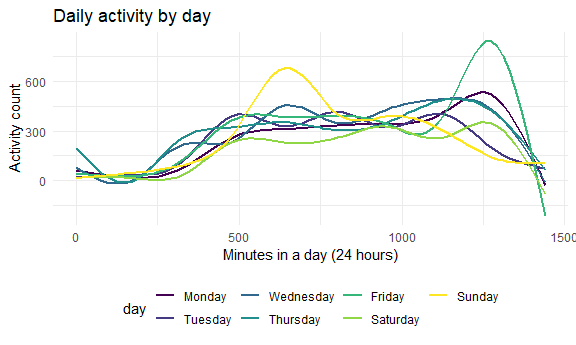
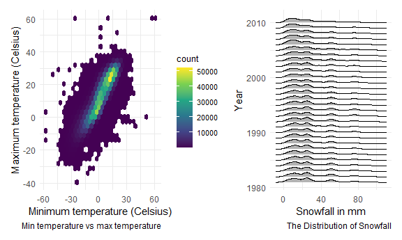

Homework 2
================
Nancy Fang (nf2466)
2020-10-11

### Problem 1

``` r
data("instacart")
```

This dataset contains 1384617 rows and 15 columns.

Observations are the level of items in orders by user. There are user /
order variables – user ID, order ID, order day, and order hour. There
are also item variables – name, aisle, department, and some numeric
codes.

How many aisles, and which are most items from?

``` r
instacart %>% 
    count(aisle) %>% 
    arrange(desc(n))
```

    ## # A tibble: 134 x 2
    ##    aisle                              n
    ##    <chr>                          <int>
    ##  1 fresh vegetables              150609
    ##  2 fresh fruits                  150473
    ##  3 packaged vegetables fruits     78493
    ##  4 yogurt                         55240
    ##  5 packaged cheese                41699
    ##  6 water seltzer sparkling water  36617
    ##  7 milk                           32644
    ##  8 chips pretzels                 31269
    ##  9 soy lactosefree                26240
    ## 10 bread                          23635
    ## # ... with 124 more rows

Let’s make a plot

``` r
instacart %>% 
    count(aisle) %>% 
    filter(n > 10000) %>% 
    mutate(
        aisle = factor(aisle),
        aisle = fct_reorder(aisle, n)
    ) %>% 
    ggplot(aes(x = aisle, y = n)) + 
    geom_point() + 
    theme(axis.text.x = element_text(angle = 90, vjust = 0.5, hjust = 1))
```


Let’s make a table\!\!

``` r
instacart %>% 
    filter(aisle %in% c("baking ingredients", "dog food care", "packaged vegetables fruits")) %>% 
    group_by(aisle) %>% 
    count(product_name) %>% 
    mutate(rank = min_rank(desc(n))) %>% 
    filter(rank < 4) %>% 
    arrange(aisle, rank) %>% 
    knitr::kable()
```

| aisle                      | product\_name                                 |    n | rank |
| :------------------------- | :-------------------------------------------- | ---: | ---: |
| baking ingredients         | Light Brown Sugar                             |  499 |    1 |
| baking ingredients         | Pure Baking Soda                              |  387 |    2 |
| baking ingredients         | Cane Sugar                                    |  336 |    3 |
| dog food care              | Snack Sticks Chicken & Rice Recipe Dog Treats |   30 |    1 |
| dog food care              | Organix Chicken & Brown Rice Recipe           |   28 |    2 |
| dog food care              | Small Dog Biscuits                            |   26 |    3 |
| packaged vegetables fruits | Organic Baby Spinach                          | 9784 |    1 |
| packaged vegetables fruits | Organic Raspberries                           | 5546 |    2 |
| packaged vegetables fruits | Organic Blueberries                           | 4966 |    3 |

Apples vs ice cream..

``` r
instacart %>% 
    filter(product_name %in% c("Pink Lady Apples", "Coffee Ice Cream")) %>% 
    group_by(product_name, order_dow) %>% 
    summarize(mean_hour = mean(order_hour_of_day)) %>% 
    pivot_wider(
        names_from = order_dow,
        values_from = mean_hour
    )%>%
  knitr::kable()
```

    ## `summarise()` regrouping output by 'product_name' (override with `.groups` argument)

| product\_name    |        0 |        1 |        2 |        3 |        4 |        5 |        6 |
| :--------------- | -------: | -------: | -------: | -------: | -------: | -------: | -------: |
| Coffee Ice Cream | 13.77419 | 14.31579 | 15.38095 | 15.31818 | 15.21739 | 12.26316 | 13.83333 |
| Pink Lady Apples | 13.44118 | 11.36000 | 11.70213 | 14.25000 | 11.55172 | 12.78431 | 11.93750 |

### Problem 2

*Part a: Load the dataset and tidy*

``` r
accel_df=
  read_csv("./data/accel_data.csv") %>%
  janitor::clean_names()%>%
  pivot_longer(activity_1:activity_1440, names_to = "activity_minute", names_prefix = "activity_", values_to = "activity_count")%>%
  mutate(activity_minute = as.numeric(activity_minute),
         day_id=as.factor(day_id),
         day=as.factor(day),
  day = factor(day, levels = str_c(c("Mon", "Tues", "Wednes", "Thurs", "Fri", "Satur", "Sun"),"day"))
  )%>%
  arrange(week, day)%>%
  mutate(
  day_type=recode(day, "Saturday" = "weekend", "Sunday" = "weekend", 
                  "Monday" = "weekday", "Tuesday" = "weekday", "Wednesday" = "weekday", 
                  "Thursday" = "weekday","Friday" = "weekday")
  )
```

    ## Parsed with column specification:
    ## cols(
    ##   .default = col_double(),
    ##   day = col_character()
    ## )

    ## See spec(...) for full column specifications.

*Part b: Now, aggregate total day activity count.*

``` r
accel_df%>%
  group_by(week,day)%>%
  summarize(count_total=sum(activity_count))%>%
  pivot_wider(
    names_from= day,
    values_from = count_total
  )%>%
  knitr::kable()
```

    ## `summarise()` regrouping output by 'week' (override with `.groups` argument)

| week |    Monday |  Tuesday | Wednesday | Thursday |   Friday | Saturday | Sunday |
| ---: | --------: | -------: | --------: | -------: | -------: | -------: | -----: |
|    1 |  78828.07 | 307094.2 |    340115 | 355923.6 | 480542.6 |   376254 | 631105 |
|    2 | 295431.00 | 423245.0 |    440962 | 474048.0 | 568839.0 |   607175 | 422018 |
|    3 | 685910.00 | 381507.0 |    468869 | 371230.0 | 467420.0 |   382928 | 467052 |
|    4 | 409450.00 | 319568.0 |    434460 | 340291.0 | 154049.0 |     1440 | 260617 |
|    5 | 389080.00 | 367824.0 |    445366 | 549658.0 | 620860.0 |     1440 | 138421 |

There doesn’t appear to be a strong pattern in terms of the total
activity count over the 5 weeks. Overall, the activity total appears
highest on Mondays and lowest on Saturdays.

*Part c:*

``` r
 accel_df_p =
  accel_df %>%
  ggplot(aes(x = activity_minute, y = activity_count, color = day)) + 
   geom_smooth(se=FALSE) +
  labs(
    title = "Daily activity by day",
    x = "Minutes in a day (24 hours)",
    y = "Activity count"
  )

accel_df_p
```

    ## `geom_smooth()` using method = 'gam' and formula 'y ~ s(x, bs = "cs")'



It appears that there is an expected pattern of low activity during
sleeping hours and more activity during the middle of the day (between
minute 500-1000). We also see that on average, there is more activity in
the morning/afternoon on Sunday and more activity in the evening time on
Fridays.

### Problem 3

*Part a: Download the NOAA dataset from P8105*

``` r
library(p8105.datasets)
data("ny_noaa")
```

In this dataset, there are 2595176 rows and 7 columns. There are 747
distinct locations in New York state. The variables also include the
date of data collection, between 1981-01-01 and 2010-12-31,
precipitation, snowfall, snow depth, max temp and min temp in Celsius.
There are 145838 missing values for precipitation, 381221 missing values
for snowfall, 591786 missing values for snow depth, 1134358 missing
values for max temp and 1134420 missing values for min temp.

*Data cleaning:*

``` r
noaa_df=
  ny_noaa%>%
  janitor::clean_names()%>%
  separate(date, into = c('year','month','day')) %>%
  mutate(month = month.abb[as.factor(month)]) %>%
  mutate_at(vars(year, day, tmax, tmin), as.numeric)%>%
  mutate(tmax=tmax/10, tmin=tmin/10)
```

For snowfall, what are the most commonly observed values? Why?

``` r
noaa_df%>%
  drop_na(snow)%>%
  group_by(snow)%>%
  summarize(snow_n=n())%>%
  arrange(desc(snow_n))
```

    ## `summarise()` ungrouping output (override with `.groups` argument)

    ## # A tibble: 281 x 2
    ##     snow  snow_n
    ##    <int>   <int>
    ##  1     0 2008508
    ##  2    25   31022
    ##  3    13   23095
    ##  4    51   18274
    ##  5    76   10173
    ##  6     8    9962
    ##  7     5    9748
    ##  8    38    9197
    ##  9     3    8790
    ## 10   102    6552
    ## # ... with 271 more rows

The most commonly observed value is 0. This is likely because it does
not snow on most days of the year in New York.

*Part b: Make a two-panel plot showing the average max temperature in
January and in July in each station across years. Is there any
observable / interpretable structure? Any outliers?*

``` r
noaa_avgtmax_p =
  noaa_df%>%
  drop_na(tmax)%>%
  filter(month==c("Jan","Jul"))%>%
  group_by(id,year,month)%>%
  summarize(avg_tmax=mean(tmax))%>%
  ggplot(aes(x = year, y = avg_tmax, group = id, color = id)) +
  geom_point() +
  geom_path() +
  facet_grid(~month)+
  guides(color="none") +
  labs(
    title = "Average max temperature in January and July by ID",
    x = "Year",
    y = "Average max temperature (Celsius)"
  )
```

    ## `summarise()` regrouping output by 'id', 'year' (override with `.groups` argument)

``` r
noaa_avgtmax_p
```


In general, we see that the average max temperature in Celsius is lower
in January than in July. During years where the average max temperature
was lower, all data points are lower. There does not seem to be a trend
of increasing average max temperatures from these graphs. There are very
few outliers in our data set.

*Part c: Make a two-panel plot showing (i) tmax vs tmin for the full
dataset; and (ii) make a plot showing the distribution of snowfall
values greater than 0 and less than 100 separately by year.*

``` r
 maxvmin_p = 
  noaa_df%>%
  drop_na(tmax,tmin)%>%
  group_by(id)%>%
  ggplot(aes(x = tmin, y = tmax)) +
  geom_hex(bins = 30) +
  guides(color="none") +
  theme(legend.position = "right", legend.title = element_text(size = 10), legend.text = element_text(size = 8)) +
  labs(
    caption = "Min temperature vs max temperature",
    x = "Minimum temperature (Celsius)",
    y = "Maximum temperature (Celsius)",
    size=rel(0.50)
  )

snowfall_p =
  noaa_df %>%
  filter(snow > 0 & snow < 100) %>%
  ggplot(aes(x =snow, y=year, group = year)) +
  ggridges::geom_density_ridges(scale = 0.85) + 
  labs(
    caption = "The Distribution of Snowfall",
    y = "Year",
    x = "Snowfall in mm",
    size=rel(0.50)
    )

maxvmin_p + snowfall_p
```

    ## Picking joint bandwidth of 3.76



The Tmin vs Tmax plot shows us that most places had a minimum
temperature around 15 degrees Celsius and a maximum temperature around
25 degrees Celsisus. The distribution of snowfall graph shows that days
there was a total snowfall of between 0-40 mm but there were many days
where snowfall was \~60 mm or even as high as \~75 mm.
